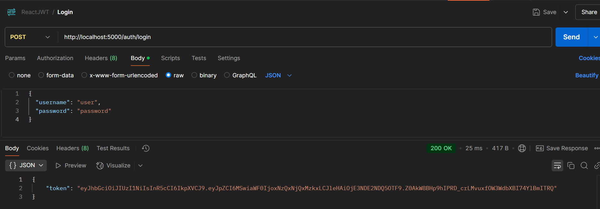
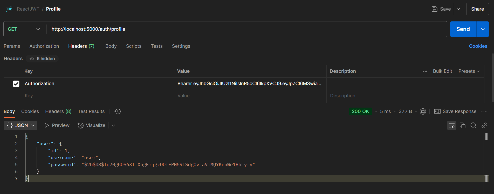

# React JWT Authentication with Express

This project demonstrates a simple JWT-based authentication system using React (TypeScript) for the frontend and Express (TypeScript) for the backend. It includes two main endpoints:
- `/login`: Authenticates the user and returns a JWT token.
- `/profile`: A protected route that requires a valid JWT token to access.

---

## **Setup Instructions**

### **1. Clone the Repository**
Clone this repository to your local machine:
```bash
git clone <repository-url>
cd <repository-folder>
2. Set Up the Backend
Navigate to the server folder:
```
```bash
cd server
```
Install dependencies:

```bash
npm install
```
Create a .env file in the server folder and add the following environment variables:

```env
JWT_SECRET=your_jwt_secret_key
PORT=5000
```
Replace your_jwt_secret_key with a secure secret key for signing JWTs.

Build and start the server:

```bash
npx tsc
node dist/index.js
```

Testing the API with Postman

1. Login Endpoint (/login)
Method: POST

URL: http://localhost:5000/auth/login



2. Profile Endpoint (/profile)
URL: http://localhost:5000/auth/profile

```
Headers:
Authorization: Bearer <JWT_TOKEN>
```
